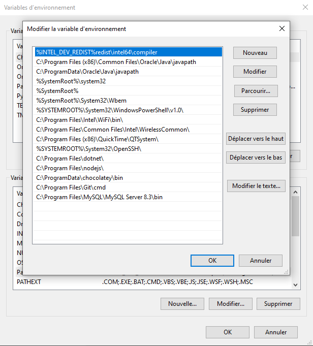
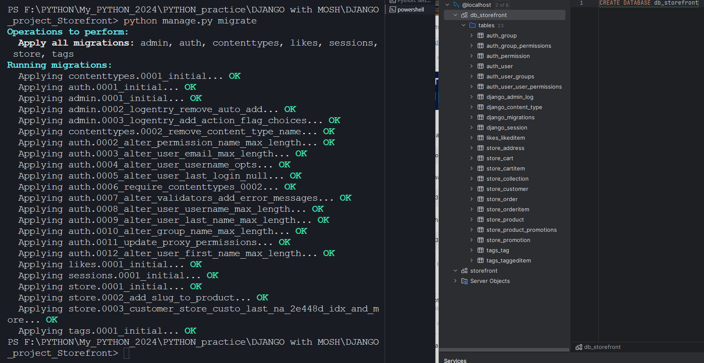

# WHAT I LEARNT

This repo is the 2nd repo of the same project. The first repo got deleted because I started it with an Anaconda virtual environment, and once I had to introduce MySQL to the project, Anaconda turned out to be non-reliable. I knew Anaconda is more skewed toward Data science and ML but I had no idea it was reluctant toward MySQL.  
Lesson learnt on my side. 

#### PROJECT DETAILS:  

VENV Manager: pipenv  
Python: v3.11  
Database: MySQL + DataGrip  

---

## Title 1

text

---

## Structure of the Data Model

The best approach consists of 2 things:  
- minimal coupling between apps
- high cohesion in each app  

By having a smaller number of apps, we decrease the need for coupling (while trying to avoid piling functionalities, which leads to the creation of a monolith-like structure).  

By not having only one app (a monolith) that does it all, we increase the cohesion of each separate app.  

It becomes obvious that there is a **fine line between these two things**, and the balance is not always clear. 

#### Our Data Structure:

So here, we decided on the following:
- store app: cart, cart items, order, customer, collections, products:  
  because all of these items are strongly related to one another
- tag app: for generic relationships (usable independently)

---

## Introduction to MYSQL

Here I only just touched the surface of Databases. Installing MYSQL and DataGrip and creating a new database in DataGrip.  
Why DataGrip? Just because the course I am following is using it. But MYSQL Workbench is an alternative (though less optimal, according to the course). 

#### Windows Environment Variables

I had to fix an error generated after I installed MySQL. In VsCode terminal (powershell) the `mysql` command returned an error saying it was not valid.  
After I researched the issue, I found the answer and fixed it by adding the mysql path as a new path in my Windows environment variables.  
This is the last line in this screenshot:

Once fixed I was then able to connect my mysql server to my app project. So my database migrations now show up in the database I setup previously, and visually available in DataGrip:

#### Database Password

I tried using again the dotenv module to hide the database password in the .env file. This generates errors when running the server (`python manage.py runserver`), but at least the password is not public in my github repository.  
This inefficient way of hiding it before I commit to the repo  is what I found so far, and I'll use it until I have a better option. 

--- 

## Title 3

Text

--- 

## How Well Did I do?

After I compared my code to the solutions: 
- **exercise **:  
  Text 

  GRADE: Text. 

- **exercise **:  
  Text. 

- **exercise **:

#### Resources:
[Code with Mosh Online Course: Ultimate Django](codewithmosh.com/courses/the-ultimate-django-part1-1)  
[DataGrip from Jetbrains](https://www.jetbrains.com/datagrip/download/download-thanks.html?platform=windows)  
[MySQL](https://dev.mysql.com/downloads/windows/)  

